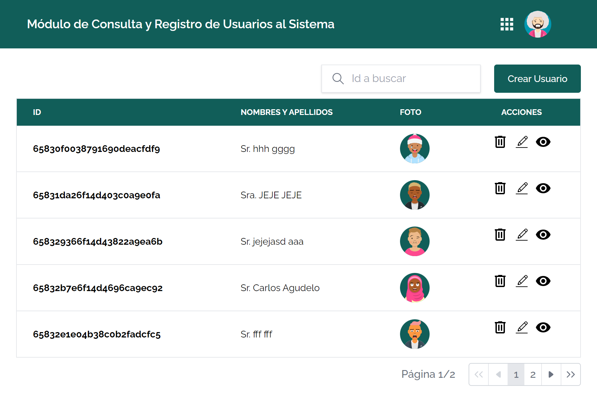
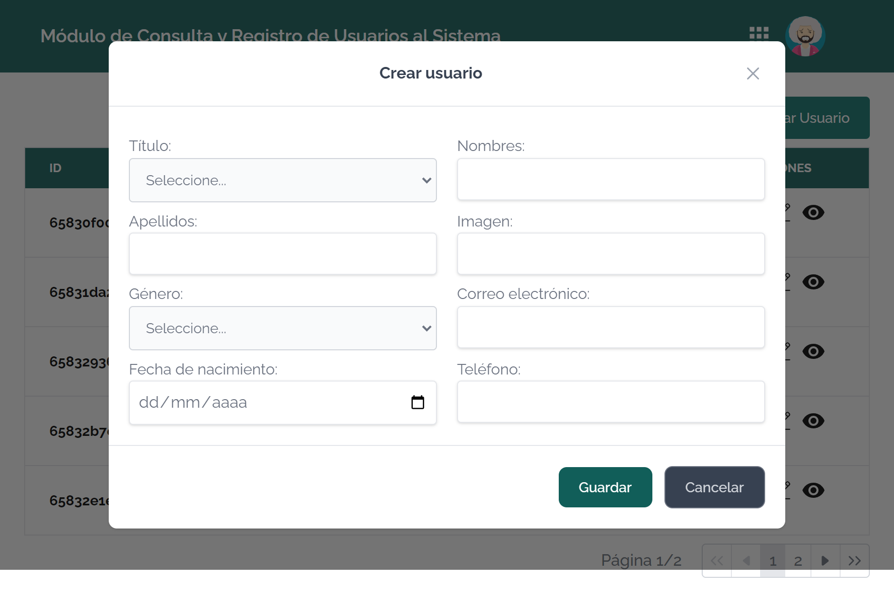
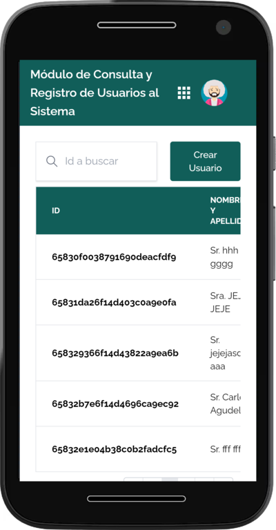

<h1 align="center">Finanzauto Test</h1>

<div align="center">
  <h3>
    <a href="https://finanzauto-test-danielpaz98.vercel.app" target="_blank">
      Demo
    </a>
  </h3>
</div>

<!-- TABLE OF CONTENTS -->

## Table of Contents

- [Table of Contents](#table-of-contents)
- [Overview](#overview)
- [How To Use](#how-to-use)

<!-- OVERVIEW -->

## Overview

<h1 align="center">Desktop</h1>

<div align="center">
	
</div>

<div align="center">
	
</div>

<h1 align="center">Mobile</h1>

<div align="center">
	
</div>

## How To Use

To clone and run this application, you'll need [Git](https://git-scm.com), [Node.js](https://nodejs.org/en/download/) and [pnpm](https://pnpm.io) installed on your computer. From your command line:

```bash
# Clone this repository
$ git clone https://github.com/danielpaz98/finanzauto-test

# Install dependencies
$ pnpm install

# Serve with hot reload at localhost:5174
$ pnpm dev

# Build for production and launch server
$ pnpm build
$ pnpm preview
```
